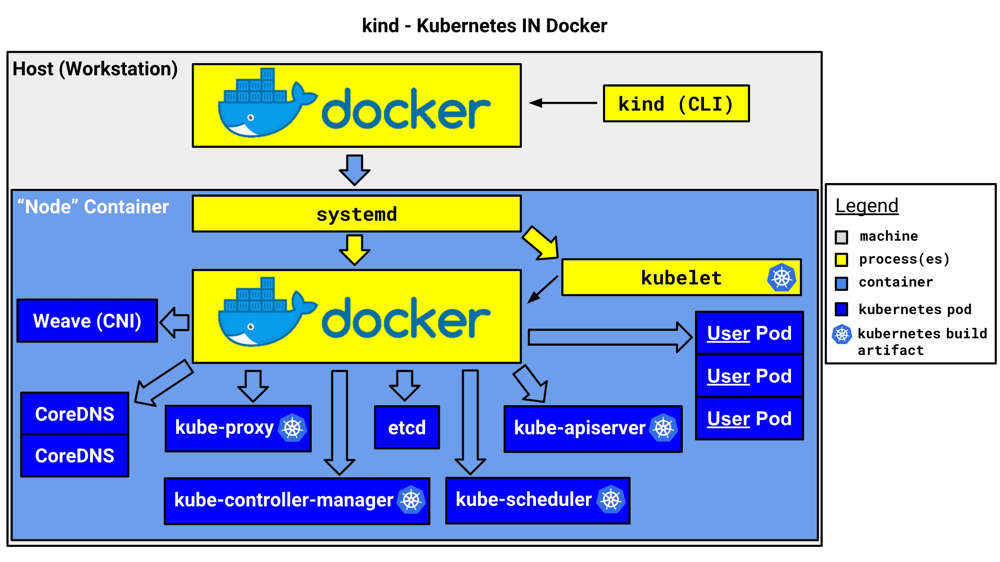

# Intro to Kind

Kubernetes IN Docker - local clusters for testing Kubernetes

## Brief

[Kind(Kubernetes IN Docker)](https://github.com/kubernetes-sigs/kind) 是一个用来快速创建和测试 `kubernetes` 的工具，`Kind` 把环境的依赖降低到了最小，仅需要机器安装了 `docker` 即可。

**Kind 可以做什么**

- 快速创建一个或多个 `kubernetes` 集群（几分钟）
- 支持 `ha master` 部署高可用的 `kubernetes` 集群
- 支持从源码构建并部署一个 `kubernetes` 集群
- 可以快速低成本体验一个最新的 `kubernetes` 集群，并支持 `kubernetes` 的绝大部分功能
- 支持本地离线运行一个多节点集群

**Kind 有哪些优势**

- 最小的安装依赖，仅需要安装 `docker` 即可
- 使用快速简单，使用 `kind cli` 工具即可快速创建集群
- 使用 `container` 来 mock `kubernetes node`
- 内部使用 `kubeadm` 的官方主流部署工具
- 使用了 `containerd`
- 通过了 `cncf` 官方的 `k8s conformance` 测试

## Usage

```
GO111MODULE="on" go get sigs.k8s.io/kind@v0.3.0 && kind create cluster
```

## How it work

`Kind` 使用一个 `container` 来模拟一个 `node`，在 `container` 里面跑了 `systemd` ，并用 `systemd` 托管了 `kubelet` 以及 `containerd`，然后容器内部的 `kubelet` 把其他 k8s 组件，比如 `kube-apiserver`, `etcd`, `cni` 等组件跑起来

可以通过配置文件的方式，来通过创建多个 `container` 的方式，来模拟创建多个 `node`，并以这些 `node` 来构建一个多节点的 `kubernetes` 集群

`Kind` 内部使用了 `kubeadm` 这个工具来做集群的部署，包括 `ha master` 的高可用集群，也是借助 `kubeadm` 提供的 `aplha` 特性提供的。同时，在 `ha master` 下，额外部署了一个 `nginx` 用来提供负载均衡 `vip`


（https://kind.sigs.k8s.io/docs/design/initial/）

### 镜像构建

`Kind` 的镜像分为两个，一个 `base` 镜像，一个 `node` 镜像

**base 镜像**

`base` 镜像目前使用了 `ubuntu:19.04` 作为基础镜像，做了下面的调整：

- 安装 `systemd` 相关的包，并调整一些配置以适应在容器内运行
- 安装 `k8s` 运行时的依赖包，比如 `conntrack` `socat` `cni`
- 安装容器运行环境，比如 `containerd` `crictl`
- 配置自己的 `ENTRYPOINT` 脚本，以适应和调整容器内运行的问题

具体的逻辑，可以参考构建的 [Dockerfile](https://github.com/kubernetes-sigs/kind/blob/master/images/base/Dockerfile)

**node 镜像**

`node` 镜像的构建比较复杂，目前是通过运行 `base` 镜像，并在 `base` 镜像内执行操作，再保存此容器内容为镜像的方式来构建的，包含的操作有：

- 构建 `Kubernetes` 相关资源（比如二进制文件和镜像）
- 运行一个用于构建的容器
- 把构建的 `Kubernetes` 相关资源复制到容器里
- 调整部分组件配置参数，以支持在容器内运行
- 预先拉去运行环境需要的镜像
- 通过 `docker commit` 方式保存当前的构建容器为 `node` 镜像

具体的逻辑，可以参考 [node.go](https://github.com/kubernetes-sigs/kind/blob/master/pkg/build/node/node.go)

### 集群创建

`Kind` 创建集群的基本过程为:

1. 根据传入的参数，来创建 `container`，分为 `control node` 和 `worker node` 两种（如果是 `ha master`，还有一个 `loadbalancer node`）
2. 如果需要，配置 `loadbalancer` 的配置，主要是 `nginx` 配置文件
3. 生成 `kubeadm` 配置
4. 对于第一个控制节点，使用 `kubeadm init` 初始化单节点集群
5. 配置安装 `cni` 插件
6. 配置存储（实际是安装了一个使用 `hostpath` 的 `storageclass`）
7. 其他的控制节点，通过 `kubeadm join --experimental-control-plane` 的方式来扩容控制节点
8. 通过 `kubeadm join` 扩容其他的工作节点
9. 等待集群创建完成
10. 生成访问配置，打印使用帮助

具体的创建流程，可以参考代码 [create.go](https://github.com/kubernetes-sigs/kind/blob/master/pkg/cluster/internal/create/create.go#L55)

这里关于每个容器，是如何作为 `node` 跑起来的，可以简单讲解些原理：

根据不同的角色，调用不同的函数创建节点

(https://github.com/kubernetes-sigs/kind/blob/master/pkg/cluster/internal/create/nodes.go#L196)
```
// TODO(bentheelder): remove network in favor of []cri.PortMapping when that is in
func (d *nodeSpec) Create(clusterLabel string) (node *nodes.Node, err error) {
	// create the node into a container (docker run, but it is paused, see createNode)
	// TODO(bentheelder): decouple from config objects further
	switch d.Role {
	case constants.ExternalLoadBalancerNodeRoleValue:
		node, err = nodes.CreateExternalLoadBalancerNode(d.Name, d.Image, clusterLabel, d.APIServerAddress, d.APIServerPort)
	case constants.ControlPlaneNodeRoleValue:
		node, err = nodes.CreateControlPlaneNode(d.Name, d.Image, clusterLabel, d.APIServerAddress, d.APIServerPort, d.ExtraMounts)
	case constants.WorkerNodeRoleValue:
		node, err = nodes.CreateWorkerNode(d.Name, d.Image, clusterLabel, d.ExtraMounts)
	default:
		return nil, errors.Errorf("unknown node role: %s", d.Role)
	}
	return node, err
}
```

节点（容器）创建时，通过配置 `--privileged`，挂载 `tmpfs`，修改主机名等，来运行节点

(https://github.com/kubernetes-sigs/kind/blob/master/pkg/cluster/nodes/create.go#L124)

```
func createNode(name, image, clusterLabel, role string, mounts []cri.Mount, extraArgs ...string) (handle *Node, err error) {
	runArgs := []string{
		"-d", // run the container detached
		"-t", // allocate a tty for entrypoint logs
		// running containers in a container requires privileged
		// NOTE: we could try to replicate this with --cap-add, and use less
		// privileges, but this flag also changes some mounts that are necessary
		// including some ones docker would otherwise do by default.
		// for now this is what we want. in the future we may revisit this.
		"--privileged",
		"--security-opt", "seccomp=unconfined", // also ignore seccomp
		"--tmpfs", "/tmp", // various things depend on working /tmp
		"--tmpfs", "/run", // systemd wants a writable /run
		// some k8s things want /lib/modules
		"-v", "/lib/modules:/lib/modules:ro",
		"--hostname", name, // make hostname match container name
		"--name", name, // ... and set the container name
		// label the node with the cluster ID
		"--label", clusterLabel,
		// label the node with the role ID
		"--label", fmt.Sprintf("%s=%s", constants.NodeRoleKey, role),
	}

	// pass proxy environment variables to be used by node's docker deamon
	proxyDetails := getProxyDetails()
	for key, val := range proxyDetails.Envs {
		runArgs = append(runArgs, "-e", fmt.Sprintf("%s=%s", key, val))
	}

	// adds node specific args
	runArgs = append(runArgs, extraArgs...)

	if docker.UsernsRemap() {
		// We need this argument in order to make this command work
		// in systems that have userns-remap enabled on the docker daemon
		runArgs = append(runArgs, "--userns=host")
	}

	err = docker.Run(
		image,
		docker.WithRunArgs(runArgs...),
		docker.WithMounts(mounts),
	)

	// we should return a handle so the caller can clean it up
	handle = FromName(name)
	if err != nil {
		return handle, errors.Wrap(err, "docker run error")
	}

	return handle, nil
}
```

## More

`Kind` 是一个比较简单有趣的项目，`Kind` 的 [scope](https://kind.sigs.k8s.io/docs/contributing/project-scope/) 定的比较明确和具体，也定的比较小，其实借助 `Kind` 或者 `Kind` 的思想，可以做更多的事情，比如：

- 在单节点部署自己的上层平台
- 借助容器 mock 节点的方式，优化现有的测试方案
- 自动化的部署测试
- 自动化的 e2e 测试

**扩展阅读**

`Kind` 借助 `kubeadm` 的新特性实现了 `ha master` 高可用集群，`kubeadm` 借助 `join` 的方式来扩容 `master` 节点达到 `ha master`，其实内部的实现方式也有好有坏，有兴趣的可以参考 `kubeadm` [源码](https://github.com/kubernetes/kubernetes/tree/master/cmd/kubeadm)
