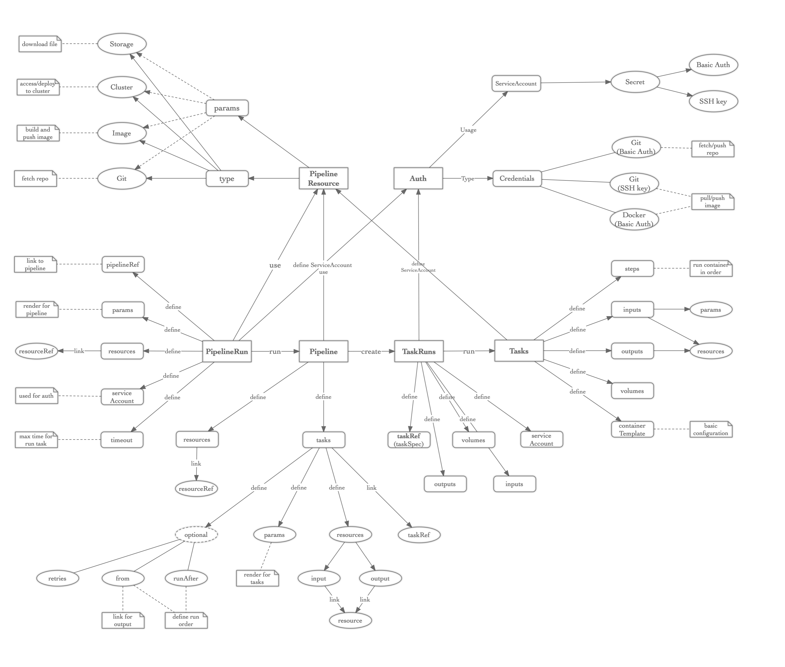

# Intro to Tekton

Kubernetes-native CI/CD building blocks.

## Install

1. 获取一个 Kubernetes 集群，可以通过:
    - 谷歌云上创建一个 [GKE](https://cloud.google.com/kubernetes-engine/) 集群
    - [k8s playground](https://www.katacoda.com/courses/kubernetes/playground) 可以快速测试
    - [docker for mac/windows](https://docs.docker.com/docker-for-mac/kubernetes/) 新版的 docker 提供了一个 Kubernetes 集群，可以用于本地测试
    - [kind](https://github.com/kubernetes-sigs/kind) Kubernetes IN Docker 可以快速构建和安装 Kubernetes 集群，用于自动化测试
2. （确保当前操作的用户有 cluster-admin 权限）
3. 安装 Tekton: `kubectl apply --filename https://storage.googleapis.com/tekton-releases/latest/release.yaml`

## Core concepts

**[Task](https://github.com/tektoncd/pipeline/blob/master/docs/tasks.md)**: 作为 `pipeline` 的基本单位，定义了一组需要运行的操作(`steps`)；可以多个 task 组成 pipeline，也可以独立运行

**[Pipeline](https://github.com/tektoncd/pipeline/blob/master/docs/pipelines.md)**: 用来编排一个或多个 `task`，并配置运行 `task` 需要的资源以及参数

**[TaskRun](https://github.com/tektoncd/pipeline/blob/master/docs/taskruns.md)**: 用来关联和触发运行 `task`

**[PipelineRun](https://github.com/tektoncd/pipeline/blob/master/docs/pipelineruns.md)**: 用来关联和触发运行 `pipeline`

**[PipelineResource](https://github.com/tektoncd/pipeline/blob/master/docs/resources.md)**: 用来定义执行 `task` 或者 `pipeline` 时需要的资源，比如 git repo，镜像等

## Workflow

1. 定义自己的 Task，包括定义具体要运行的操作（`steps`），输入输出，数据卷和容器模板
    - `steps` 提供了一个运行的容器环境，以及需要进行的操作；一个 `task` 可以有多个 `step`，每一个 `step` 顺序执行
    - `inputs`/`outputs` 提供了执行流水线时需要的资源及变量配置，比如可以预先拉取好 git repo，build 镜像等
    - `volumes` 提供数据卷给构建的容器使用，可以用于存储或者传递数据等，或者读取配置文件
    - `containerTemplate` 提供模板的功能，比如定义环境变量，可以作用于每一个 step 的执行环境中
2. 创建 `TaskRun` 来关联和触发定义好的 `Task`
    - 可以通过 `taskRef` 的方式来管理 `task`；或者直接通过 `inline` 的模式，定义 `task` 的 `taskSpec`
    - 可以指定 `serviceAccount` 来用于做认证（比如拉取 git 仓库的代码）；未指定时，默认使用当前 namespace 的 default service account
    - 可以指定 `timeout` 来配置超时时间
    - `inputs`/`outputs` 定义执行 `task` 时的变量以及资源
    - 可以通过修改 `status` 为 `TaskRunCancelled` 来取消任务
3. 也可以定义自己的 `Pipeline`，通过流水线来编排多个 `task`
    - `resources` 定义了执行 `pipeline` 时用到的资源
    - `tasks` 定义了流水线要执行的任务以及任务的编排关系
    - 通过 `from` 或 `runAfter` 可以隐示或者显示的定义执行的任务顺序
    - 没有依赖或者顺序相关的任务，会并行执行
    - `retries` 定义了任务失败时重试的次数，比如临时网络中断造成的构建失败；默认是不重试的
4. 创建 `PipelineRun` 来关联和触发定义好的 `Pipeline`
    - 通过 `pipelineRef` 来管理 `pipeline`
    - 可以指定 `serviceAccount` 来用于做认证（比如拉取 git 仓库的代码）；未指定时，默认使用当前 namespace 的 default service account
    - 可以指定 `timeout` 来配置超时时间
    - 可以指定 `resources` 来定义执行 `pipeline` 时用到的资源
    - 可以通过修改 `status` 为 `PipelineRunCancelled` 来取消流水线

## Auth

可以通过配置 `ServiceAccount` 以及关联的 `secret` 的方式，来方便配置用于访问 git 或者 docker 镜像仓库的认证信息。基本流程如下：

1. 创建一个 `ServiceAccount`，包含了用到的认证资源信息，通过给出 secret name 的方式，与实际的 auth 配置绑定
2. 创建 `secret` ，包含 `basic-auth` 和 `ssh-auth` 两种方式，提供用于登陆镜像仓库或者访问 git 仓库需要的用户名密码信息；或者提供用于访问git 仓库的 ssh key 信息
3. 在创建 `TaskRun` 或者 `PipelineRun` 时，指定使用的 `ServiceAccount`。在后续执行 `task` 时，会在执行 `task` 前，预先把认证的配置文件，放置到运行的容器环境中
4. 在执行 `task` 时，直接拉去代码仓库或者镜像仓库即可 

## In one map

## Demo(TODO)

### build tekton with tekton

### build k8s from source and run conformance test with tekton and kind

## Anything except the tekton core

- UI: 提供创建和管理的界面 e.g. [dashboard](https://github.com/tektoncd/dashboard)
- 多租户: 支持不同用户、不同租户的权限控制和管理
- 资源 qos: 限制资源消耗，保证集群稳定性
- API: 提供 api 接口供外部调用，比如使用 [nirvana](https://github.com/caicloud/nirvana)
- trigger: 支持 github gitlib 条件或者手动触发
- plugin: 支持 plugin 功能以支持更多的需求，比如 svn 的处理

## Next

[cyclone](https://github.com/caicloud/cyclone)
